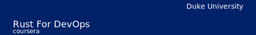

# 

# Rust Systems Programming

_Rust for DevOps week 3: Automating System Management_

This week, you will explore introductory System Automation with Rust, a fundamental exploration of DevOps practices and automation techniques. This course is structured into three lessons, providing a comprehensive introduction to system automation using Rust. In Lesson 1, "Crawling and Parsing," you'll delve into the fundamentals of navigating the filesystem, parsing various file formats, and extracting insights from log files. Lesson 2, "Running External Programs and Working with JSON," focuses on executing external programs and mastering JSON data manipulation—essential skills for any DevOps practitioner. The final lesson, "Building System Utilities," guides you in creating practical utilities, addressing permissions, compliance, and effective exit status management. Elevate your DevOps skills and streamline workflows with Rust's powerful capabilities in this comprehensive system automation course!

This is week 3 of the [Rust For DevOps](https://insight.paiml.com/prr?utm_source=GitHub "Coursera Course") course. There are 4 weeks in total:

- [week 1](https://github.com/alfredodeza/rust-setup) 
- [week 2](https://github.com/alfredodeza/rust-monitoring-logging)
- [week 3](https://github.com/alfredodeza/rust-systems-programming/) 👈 You are here!
- [week 4](https://github.com/alfredodeza/advanced-ci-cd-concepts)

💡 Are you just looking for a 👉 [Rust template](https://github.com/alfredodeza/rust-template) to get started easily with a project? The [template](https://github.com/alfredodeza/rust-template) has everything you need!

## Contents
This week has several examples located in the [./examples](./examples) directory. Make sure you have Rust installed and you are using [Visual Studio Code](https://code.visualstudio.com/?WT.mc_id=academic-0000-alfredodeza).

This repository is *Codespaces ready*, and it is set as a template repository. You can create a new repository from this template and start working on your own with Codespaces. This means that Rust, Copilot, and all the extensions are already installed and configured for you.

### Lesson 1: Introduction to System Automation
- [Crawling the filesystem](./examples/1-crawl)
- [Parsing files](./examples/2-parsing)
- [Parsing logs](./examples/3-parsing-log-files)

### Lesson 2: Running external programs
- [External programs](./examples/5-external-programs)
- [Working with JSON](./examples/6-json)

### Lesson 3: Building System utilities
- [Permissions and Compliance](./examples/7-compliance)
- [Compliance logic](./examples/8-compliance-logic)
- [Working with Exit Status](./examples/9-exit-status)

## Resources

- [Rust Book](https://doc.rust-lang.org/book/)
- [First steps with Rust Learning Path](https://learn.microsoft.com/training/paths/rust-first-steps/?WT.mc_id=academic-0000-alfredodeza)
- [DevOps command-line tools in Python and Rust](https://learning.oreilly.com/videos/devops-command-line-tools/28037639VIDEOPAIML/)

**Coursera Courses**

- [MLOps Machine Learning Operations Specialization](https://www.coursera.org/specializations/mlops-machine-learning-duke)
- [Linux and Bash for Data Engineering](https://www.coursera.org/learn/linux-and-bash-for-data-engineering-duke)
- [Open Source Platforms for MLOps](https://www.coursera.org/learn/open-source-platforms-duke)
- [Python Essentials for MLOps](https://www.coursera.org/learn/python-essentials-mlops-duke)
- [Web Applications and Command-Line tools for Data Engineering](https://www.coursera.org/learn/web-app-command-line-tools-for-data-engineering-duke)
- [Python and Pandas for Data Engineering](https://www.coursera.org/learn/python-and-pandas-for-data-engineering-duke)
- [Scripting with Python and SQL for Data Engineering](https://www.coursera.org/learn/scripting-with-python-sql-for-data-engineering-duke)
